<h1 align="center">HARUN EMİRHAN BOSTANCI</h1>
<h3 align="center">AI & Data Science Engineer | LLM Orchestrator</h3>

  

---

### ⚡ About Me
I develop autonomous AI systems and high-performance data architectures. My focus is on Python-driven **End-to-End AI Solutions**, **LLM Orchestration**, and **Automated Data Pipelines**. I prioritize radical efficiency and raw data accuracy over boilerplate solutions.

* **Core Competencies:** End-to-End AI Solutions, Large Scale Data Analysis, Autonomous AI Agents.
* **Ecosystem:** Heavy reliance on API-based and local LLMs (Groq, Llama architecture), avoiding standard wrappers for granular control.
* **Philosophy:** Code must be a flawless execution of data-driven reality.

---

### 🏆 Engineering Achievements

  

---

### 🛠️ Tech Stack & Ecosystem

**AI, Machine Learning & LLM Infrastructure**

  
  
  
  
  
  

**Architecture & Tools**

  
  
  
  
  
  

---

### 📈 Advanced Metrics & Coding Habits
<!-- Bu görsel GitHub Action ile senin repoda her gece otomatik oluşturulacak -->

  

---

### 📫 Contact & Connections

  
  
  

